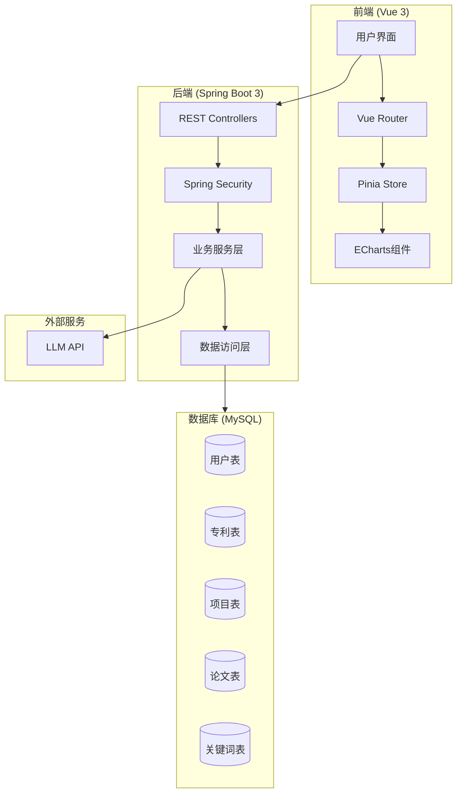
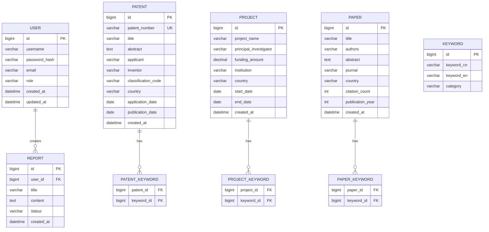

# Design Document: 技术解析平台

## Overview

技术解析平台是一个基于Vue 3 + Spring Boot 3 + MySQL + ECharts的全栈应用，用于技术领域的细粒度分析。系统采用前后端分离架构，前端使用Vue 3构建SPA应用，后端使用Spring Boot 3提供RESTful API，数据存储使用MySQL，可视化使用ECharts。

### 核心功能模块
1. **用户认证模块** - JWT认证、角色权限管理
2. **数据导入模块** - Excel解析、数据验证、批量导入
3. **知识库模块** - 专利/论文/项目数据存储与检索
4. **可视化模块** - 技术图谱、趋势分析、关联图谱
5. **报告生成模块** - LLM集成、流式输出、模板管理

## Architecture

### 系统架构图



### 技术选型

| 层级 | 技术 | 说明 |
|------|------|------|
| 前端框架 | Vue 3 + TypeScript | 组合式API，类型安全 |
| 状态管理 | Pinia | Vue 3官方推荐 |
| 路由 | Vue Router 4 | SPA路由管理 |
| UI组件 | Tailwind CSS | 原子化CSS框架 |
| 图表 | ECharts 5 | 丰富的可视化能力 |
| 后端框架 | Spring Boot 3 | Java 17+，现代化开发 |
| 安全 | Spring Security + JWT | 无状态认证 |
| ORM | MyBatis-Plus | 简化数据库操作 |
| 数据库 | MySQL 8 | 关系型数据存储 |
| Excel解析 | Apache POI | Excel文件处理 |

## Components and Interfaces

### 前端组件结构

```
src/
├── components/
│   ├── common/           # 通用组件
│   │   ├── Header.vue
│   │   ├── Sidebar.vue
│   │   └── Loading.vue
│   ├── charts/           # ECharts图表组件
│   │   ├── WorldMap.vue
│   │   ├── TrendChart.vue
│   │   ├── NetworkGraph.vue
│   │   └── BarChart.vue
│   ├── data/             # 数据管理组件
│   │   ├── ExcelUploader.vue
│   │   ├── DataPreview.vue
│   │   └── DataTable.vue
│   └── report/           # 报告组件
│       ├── ReportGenerator.vue
│       └── ReportViewer.vue
├── views/
│   ├── Login.vue
│   ├── Dashboard.vue
│   ├── TechMap.vue
│   ├── TrendAnalysis.vue
│   ├── ThreeLayers.vue
│   ├── Report.vue
│   └── AdminDashboard.vue
├── stores/
│   ├── user.ts
│   ├── patent.ts
│   ├── project.ts
│   └── analysis.ts
├── api/
│   ├── auth.ts
│   ├── patent.ts
│   ├── project.ts
│   ├── analysis.ts
│   └── report.ts
└── utils/
    ├── request.ts        # Axios封装
    ├── echarts.ts        # ECharts配置
    └── excel.ts          # Excel处理
```

### 后端模块结构

```
src/main/java/com/techanalysis/
├── controller/
│   ├── AuthController.java
│   ├── PatentController.java
│   ├── ProjectController.java
│   ├── PaperController.java
│   ├── AnalysisController.java
│   └── ReportController.java
├── service/
│   ├── AuthService.java
│   ├── PatentService.java
│   ├── ProjectService.java
│   ├── PaperService.java
│   ├── AnalysisService.java
│   ├── ReportService.java
│   └── ExcelImportService.java
├── repository/
│   ├── UserRepository.java
│   ├── PatentRepository.java
│   ├── ProjectRepository.java
│   └── PaperRepository.java
├── entity/
│   ├── User.java
│   ├── Patent.java
│   ├── Project.java
│   ├── Paper.java
│   └── Keyword.java
├── dto/
│   ├── LoginRequest.java
│   ├── PatentDTO.java
│   ├── ProjectDTO.java
│   └── AnalysisResult.java
├── config/
│   ├── SecurityConfig.java
│   ├── CorsConfig.java
│   └── MyBatisConfig.java
└── util/
    ├── JwtUtil.java
    ├── ExcelParser.java
    └── JsonSerializer.java
```

### API接口设计

#### 认证接口
```
POST /api/auth/login          # 用户登录
POST /api/auth/register       # 用户注册
POST /api/auth/logout         # 用户登出
GET  /api/auth/profile        # 获取用户信息
```

#### 数据导入接口
```
POST /api/admin/import/patent   # 导入专利数据
POST /api/admin/import/project  # 导入项目数据
POST /api/admin/import/paper    # 导入论文数据
GET  /api/admin/import/preview  # 预览导入数据
POST /api/admin/import/confirm  # 确认导入
```

#### 数据查询接口
```
GET  /api/patents              # 获取专利列表
GET  /api/patents/{id}         # 获取专利详情
GET  /api/projects             # 获取项目列表
GET  /api/projects/{id}        # 获取项目详情
GET  /api/papers               # 获取论文列表
GET  /api/search               # 全局搜索
```

#### 分析接口
```
GET  /api/analysis/techmap           # 技术图谱数据
GET  /api/analysis/trend             # 趋势分析数据
GET  /api/analysis/competition       # 竞争态势数据
GET  /api/analysis/comparison        # 国内外对比数据
GET  /api/analysis/network           # 关联网络数据
```

#### 报告接口
```
POST /api/report/generate      # 生成报告（流式）
GET  /api/report/list          # 报告列表
GET  /api/report/{id}          # 获取报告详情
GET  /api/report/{id}/download # 下载报告
```

## Data Models

### 数据库ER图



### 实体类定义

#### Patent实体
```java
@Data
@TableName("patent")
public class Patent {
    @TableId(type = IdType.AUTO)
    private Long id;
    private String patentNumber;
    private String title;
    private String abstractText;
    private String applicant;
    private String inventor;
    private String classificationCode;
    private String country;
    private LocalDate applicationDate;
    private LocalDate publicationDate;
    private LocalDateTime createdAt;
    
    @TableField(exist = false)
    private List<Keyword> keywords;
}
```

#### Project实体
```java
@Data
@TableName("project")
public class Project {
    @TableId(type = IdType.AUTO)
    private Long id;
    private String projectName;
    private String principalInvestigator;
    private BigDecimal fundingAmount;
    private String institution;
    private String country;
    private LocalDate startDate;
    private LocalDate endDate;
    private LocalDateTime createdAt;
    
    @TableField(exist = false)
    private List<Keyword> keywords;
}
```

### JSON序列化格式

#### 专利数据JSON格式
```json
{
  "id": 1,
  "patentNumber": "CN202410001234",
  "title": "一种人工智能算法",
  "abstract": "本发明涉及...",
  "applicant": "某科技公司",
  "inventor": "张三",
  "classificationCode": "G06F",
  "country": "中国",
  "applicationDate": "2024-01-15",
  "publicationDate": "2024-06-15",
  "keywords": [
    {"id": 1, "keywordCn": "人工智能", "keywordEn": "artificial intelligence"},
    {"id": 2, "keywordCn": "深度学习", "keywordEn": "deep learning"}
  ]
}
```

#### 项目数据JSON格式
```json
{
  "id": 1,
  "projectName": "量子计算关键技术研究",
  "principalInvestigator": "李四",
  "fundingAmount": 5000000.00,
  "institution": "中国科学院",
  "country": "中国",
  "startDate": "2024-01-01",
  "endDate": "2026-12-31",
  "keywords": [
    {"id": 3, "keywordCn": "量子计算", "keywordEn": "quantum computing"}
  ]
}
```


## Correctness Properties

*A property is a characteristic or behavior that should hold true across all valid executions of a system—essentially, a formal statement about what the system should do. Properties serve as the bridge between human-readable specifications and machine-verifiable correctness guarantees.*

### Property 1: Patent Serialization Round-Trip

*For any* valid Patent object, serializing it to JSON and then deserializing the JSON back to a Patent object SHALL produce an object equivalent to the original.

**Validates: Requirements 3.3, 3.4, 3.5**

### Property 2: Project Serialization Round-Trip

*For any* valid Project object, serializing it to JSON and then deserializing the JSON back to a Project object SHALL produce an object equivalent to the original.

**Validates: Requirements 4.3, 4.4, 4.5**

### Property 3: Report Serialization Round-Trip

*For any* valid Report object, serializing it to JSON and then deserializing the JSON back to a Report object SHALL produce an object equivalent to the original.

**Validates: Requirements 9.7, 9.8**

### Property 4: Authentication Correctness

*For any* registered user, providing correct credentials SHALL result in successful authentication, and providing incorrect credentials SHALL result in authentication failure.

**Validates: Requirements 1.2, 1.3**

### Property 5: Authorization Enforcement

*For any* unauthenticated request to a protected endpoint, the system SHALL return an unauthorized response (401 or 403).

**Validates: Requirements 1.4**

### Property 6: Excel Parsing Completeness

*For any* valid Excel file with N data rows, the parser SHALL extract exactly N records with all required fields populated.

**Validates: Requirements 2.1, 2.2, 2.3**

### Property 7: Data Validation Correctness

*For any* Excel file with invalid data format, the validator SHALL detect and report all validation errors without data loss.

**Validates: Requirements 2.4**

### Property 8: Data Import Persistence

*For any* confirmed data import operation, all imported records SHALL be retrievable from the database with identical field values.

**Validates: Requirements 2.7**

### Property 9: Patent Field Completeness

*For any* stored Patent record, all required fields (patent number, title, applicant, country, application date) SHALL be non-null and valid.

**Validates: Requirements 3.1**

### Property 10: Project Field Completeness

*For any* stored Project record, all required fields (project name, principal investigator, institution, country) SHALL be non-null and valid.

**Validates: Requirements 4.1**

### Property 11: Time-Based Filtering Correctness

*For any* time range filter [start, end], all returned records SHALL have dates within the specified range, and no records outside the range SHALL be included.

**Validates: Requirements 7.2**

### Property 12: Country-Based Filtering Correctness

*For any* country filter, all returned records SHALL belong to the specified country, and no records from other countries SHALL be included.

**Validates: Requirements 7.3**

### Property 13: Growth Rate Calculation Correctness

*For any* two consecutive time periods with counts C1 and C2, the calculated growth rate SHALL equal (C2 - C1) / C1 * 100%.

**Validates: Requirements 6.5**

### Property 14: Technology Comparison Symmetry

*For any* comparison between country A and country B, if A leads in metric M, then B SHALL lag in metric M, and vice versa.

**Validates: Requirements 8.3, 8.4**

### Property 15: Search Result Relevance

*For any* search query Q, all returned results SHALL contain at least one matching term from Q in their searchable fields.

**Validates: Requirements 11.1**

### Property 16: Multi-Filter Conjunction

*For any* combination of filters (country, time, category), the result set SHALL be the intersection of individual filter results.

**Validates: Requirements 11.2**

### Property 17: Report Structure Completeness

*For any* generated report, it SHALL contain all required sections: executive summary, technology overview, competitive analysis, trend analysis, and recommendations.

**Validates: Requirements 9.3**

### Property 18: Network Graph Connectivity

*For any* three-layer network graph, each node in layer N (N > 1) SHALL have at least one connection to a node in layer N-1.

**Validates: Requirements 10.2**

### Property 19: Error Handling Graceful Degradation

*For any* database operation failure, the system SHALL return a user-friendly error message without exposing internal details or crashing.

**Validates: Requirements 12.3, 12.5**

## Error Handling

### 前端错误处理

```typescript
// 全局错误处理
const errorHandler = {
  // API错误处理
  handleApiError(error: AxiosError): void {
    if (error.response) {
      switch (error.response.status) {
        case 401:
          // 未认证，跳转登录
          router.push('/login');
          break;
        case 403:
          // 无权限
          ElMessage.error('您没有权限执行此操作');
          break;
        case 404:
          ElMessage.error('请求的资源不存在');
          break;
        case 500:
          ElMessage.error('服务器内部错误，请稍后重试');
          break;
        default:
          ElMessage.error(error.response.data.message || '请求失败');
      }
    } else if (error.request) {
      ElMessage.error('网络连接失败，请检查网络');
    }
  },
  
  // Excel解析错误处理
  handleExcelError(error: ExcelParseError): void {
    const messages = error.errors.map(e => `行${e.row}: ${e.message}`);
    ElMessage.error({
      message: `Excel解析失败:\n${messages.join('\n')}`,
      duration: 5000
    });
  }
};
```

### 后端错误处理

```java
@RestControllerAdvice
public class GlobalExceptionHandler {
    
    @ExceptionHandler(AuthenticationException.class)
    public ResponseEntity<ErrorResponse> handleAuthError(AuthenticationException e) {
        return ResponseEntity.status(401)
            .body(new ErrorResponse("AUTH_ERROR", "认证失败，请重新登录"));
    }
    
    @ExceptionHandler(AccessDeniedException.class)
    public ResponseEntity<ErrorResponse> handleAccessDenied(AccessDeniedException e) {
        return ResponseEntity.status(403)
            .body(new ErrorResponse("ACCESS_DENIED", "您没有权限执行此操作"));
    }
    
    @ExceptionHandler(DataValidationException.class)
    public ResponseEntity<ErrorResponse> handleValidationError(DataValidationException e) {
        return ResponseEntity.badRequest()
            .body(new ErrorResponse("VALIDATION_ERROR", e.getMessage(), e.getErrors()));
    }
    
    @ExceptionHandler(ExcelParseException.class)
    public ResponseEntity<ErrorResponse> handleExcelError(ExcelParseException e) {
        return ResponseEntity.badRequest()
            .body(new ErrorResponse("EXCEL_PARSE_ERROR", "Excel文件解析失败", e.getParseErrors()));
    }
    
    @ExceptionHandler(Exception.class)
    public ResponseEntity<ErrorResponse> handleGenericError(Exception e) {
        log.error("Unexpected error", e);
        return ResponseEntity.status(500)
            .body(new ErrorResponse("INTERNAL_ERROR", "服务器内部错误，请稍后重试"));
    }
}
```

## Testing Strategy

### 测试框架选择

| 测试类型 | 前端 | 后端 |
|---------|------|------|
| 单元测试 | Vitest | JUnit 5 |
| 属性测试 | fast-check | jqwik |
| 集成测试 | Cypress | Spring Boot Test |
| API测试 | - | MockMvc |

### 单元测试策略

单元测试用于验证具体示例和边界情况：

1. **前端组件测试**
   - 测试Vue组件的渲染和交互
   - 测试Pinia store的状态管理
   - 测试工具函数的正确性

2. **后端服务测试**
   - 测试Service层业务逻辑
   - 测试Repository层数据访问
   - 测试工具类功能

### 属性测试策略

属性测试用于验证通用属性在所有输入上的正确性：

1. **序列化/反序列化测试**
   - 使用jqwik生成随机Patent/Project/Report对象
   - 验证round-trip属性
   - 最少运行100次迭代

2. **过滤器测试**
   - 生成随机数据集和过滤条件
   - 验证过滤结果的正确性
   - 验证多过滤器组合的交集性质

3. **计算测试**
   - 生成随机数值数据
   - 验证增长率计算的正确性
   - 验证排名算法的正确性

### 测试配置

```java
// jqwik属性测试配置
@PropertyDefaults(tries = 100)
public class PatentSerializationPropertyTest {
    
    @Property
    // Feature: tech-analysis-platform, Property 1: Patent Serialization Round-Trip
    void patentRoundTrip(@ForAll("validPatents") Patent patent) {
        String json = jsonSerializer.serialize(patent);
        Patent deserialized = jsonSerializer.deserialize(json, Patent.class);
        assertThat(deserialized).isEqualTo(patent);
    }
    
    @Provide
    Arbitrary<Patent> validPatents() {
        return Arbitraries.of(Patent.class)
            .map(p -> {
                p.setPatentNumber(Arbitraries.strings().alpha().ofLength(10).sample());
                p.setTitle(Arbitraries.strings().ofMinLength(1).ofMaxLength(200).sample());
                // ... 其他字段生成
                return p;
            });
    }
}
```

```typescript
// fast-check属性测试配置
import fc from 'fast-check';

describe('Patent Serialization', () => {
  // Feature: tech-analysis-platform, Property 1: Patent Serialization Round-Trip
  it('should round-trip serialize patents', () => {
    fc.assert(
      fc.property(
        fc.record({
          id: fc.nat(),
          patentNumber: fc.string({ minLength: 1, maxLength: 20 }),
          title: fc.string({ minLength: 1, maxLength: 200 }),
          country: fc.string({ minLength: 1, maxLength: 50 }),
          applicationDate: fc.date()
        }),
        (patent) => {
          const json = JSON.stringify(patent);
          const parsed = JSON.parse(json);
          expect(parsed).toEqual(patent);
        }
      ),
      { numRuns: 100 }
    );
  });
});
```


